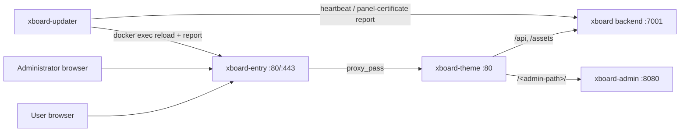

# Default Xboard deployment with Docker Compose

The default Compose suite runs four long-lived components plus two one-shot
helpers:

| Service | Component | Purpose |
| --- | --- | --- |
| `xboard` | Xboard backend | Panel API, embedded Web/Horizon/Redis processes |
| `xboard-theme` | DK_Theme | User-facing panel; proxies the panel API and routes the administrator path |
| `xboard-admin` | Xboard-Admin | Standalone administrator UI (no published port) |
| `xboard-updater` | xboard-admin-updater | Update executor and panel-certificate reconciler |
| `updater-bootstrap` | one-shot | Registers backend/admin/theme targets and the panel entry with the panel |
| `xboard-entry` (optional overlay) | Caddy | Public HTTPS entry with automatic ACME, managed by the updater |

All images must be selected by exact published version tags, taken from the
same Xboard `release-manifest.json` component suite. `XBOARD_ADMIN_VERSION`
and `XBOARD_UPDATER_VERSION` must be identical. Never use `latest`, a branch
name, or a locally rebuilt image for an installation that should be
updateable from the panel.

The updater needs the Docker socket because it replaces Compose services,
reloads the entry, and performs recovery. The socket is equivalent to
host-level Docker control; keep the deployment directory, updater volumes, and
host access restricted to trusted administrators.

## Quick start with the install script

The release asset `install.sh` deploys the complete suite with the Caddy
entry in one command on a fresh Linux host:

~~~bash
sudo ./install.sh --domain panel.example.com --email you@example.com
~~~

The script:

1. resolves the release (stable/dev channel or an exact `--version`) and
   reads the matching component suite from `release-manifest.json`;
2. preflights ports 80/443 and DNS;
3. writes a minimal deployment `.env`, the admin route token, and the entry
   Caddyfile placeholder;
4. starts the suite and runs the non-interactive panel install
   (SQLite + embedded Redis; `ADMIN_ACCOUNT`, `ADMIN_PASSWORD_FILE`,
   `ADMIN_SECURE_PATH`, `APP_URL` are passed via `docker compose exec`);
5. registers the panel entry certificate resource and prints the
   administrator URL, credentials, and an MCP key.

The installer targets a fresh directory only. Upgrades and rollbacks are
performed from the Admin panel (版本更新), never by running the script again
over an installation. Run `sudo ./install.sh --help` for all options.

## Manual installation

Use a dedicated absolute directory. The same path must be visible on the host
and inside xboard-updater; this is required because the updater passes the
Compose file path to the host Docker daemon.

~~~bash
install -d -m 700 /opt/xboard
cd /opt/xboard

# Obtain these files from the exact Xboard release assets or a checked-out
# source tree at the release commit.
cp compose.sample.yaml compose.yaml
~~~

Write a **minimal** `.env` containing only the deployment variables. Do not
copy `.env.example` over it: the installer merges any missing defaults itself,
and a preloaded full example (for example `INSTALLED=false` plus a redis cache
driver) breaks the non-interactive install.

~~~dotenv
XBOARD_DEPLOY_DIR=/opt/xboard
XBOARD_VERSION=vX.Y.Z
XBOARD_THEME_VERSION=vA.B.C
XBOARD_ADMIN_VERSION=vA.B.C
XBOARD_UPDATER_VERSION=vA.B.C
XBOARD_PANEL_URL=https://panel.example.com
~~~

Create the admin route token, start the stack, and install:

~~~bash
install -d -m 0755 secrets
umask 027 && head -c 32 /dev/urandom | base64 | tr -d '=+/' \
  > secrets/admin_route_token
chown root:1000 secrets/admin_route_token

./deploy/compose/validate.sh compose.yaml
docker compose --env-file .env -f compose.yaml up -d --wait
~~~

The installer reads its inputs from environment variables (`ENABLE_SQLITE`,
`ENABLE_REDIS`, `ADMIN_ACCOUNT`, `ADMIN_PASSWORD` or `ADMIN_PASSWORD_FILE`,
optional `ADMIN_SECURE_PATH`, `APP_URL`) and turns fully non-interactive when
they are set. Pass the password via a file to keep it out of process
environments:

~~~bash
printf '%s' 'your-admin-password' > /tmp/admin_password
chmod 600 /tmp/admin_password
docker cp /tmp/admin_password xboard-app:/tmp/admin_password
docker compose --env-file .env -f compose.yaml exec -T \
  -e ENABLE_SQLITE=1 -e ENABLE_REDIS=1 \
  -e ADMIN_ACCOUNT=admin@example.com \
  -e ADMIN_PASSWORD_FILE=/tmp/admin_password \
  -e ADMIN_SECURE_PATH=myadminpath \
  -e APP_URL=https://panel.example.com \
  xboard php artisan xboard:install
docker exec xboard-app rm -f /tmp/admin_password
rm -f /tmp/admin_password
~~~

Startup order is part of the contract:

1. xboard becomes healthy.
2. updater-bootstrap provisions the panel executor through Artisan, writes
   the token with mode 0600, and generates the updater configuration and
   fixed backend hook in its private volumes. With `XBOARD_ENTRY_ENABLED=1`
   it also registers the panel entry (Caddy container, Caddyfile path,
   seed domains, theme upstream).
3. xboard-theme and xboard-admin start after the backend health check.
4. xboard-updater starts only after bootstrap exits successfully.

The bootstrap is idempotent. Restarting or recreating the one-shot service
does not rotate a working executor credential.

After the install, the user panel is served by the theme container
(published port 7002 by default as a plain-HTTP fallback) and the standalone
Admin is reachable through the theme at `https://PANEL_HOST/<admin-path>/`.
The backend port 7001 stays as an unencrypted local fallback.

## Scenario A — Caddy HTTPS entry (default)

Add the entry overlay on a host where ports 80/443 are free and the panel
domain points at the server:

~~~bash
cp compose.entry.sample.yaml compose.entry.yaml
install -d -m 0755 entry
printf '{\n\tadmin :2019\n}\n' > entry/Caddyfile

cat >> .env <<'ENV'
XBOARD_ENTRY_ENABLED=1
XBOARD_PANEL_DOMAIN=panel.example.com
ENV

./deploy/compose/validate.sh compose.yaml
docker compose --env-file .env -f compose.yaml -f compose.entry.yaml up -d --wait
~~~

The placeholder Caddyfile must exist before the first start; an empty file is
not a valid Caddyfile. Do not edit the Caddyfile afterwards — the updater
rewrites it.

Certificates are managed as panel-scope resources:

- The updater renders the entry Caddyfile from the panel certificate
  resources in the Admin UI (证书管理 → 面板) and falls back to
  `XBOARD_PANEL_DOMAIN` (or the host of `XBOARD_PANEL_URL`) for domains
  without a certificate resource, so the panel never locks itself out.
- `acme_http` sources are signed by Caddy itself (HTTP-01/TLS-ALPN). Renewals
  and domain changes are performed by the updater: it clears Caddy's cached
  certificate for the affected domains and reloads, which triggers a fresh
  ACME issuance.
- `path` sources reference certificate files visible inside the entry
  container (mount them via your own overlay); `content` sources are
  materialized by the updater into the shared `entry-certs` volume.
- The updater verifies the resulting certificates (validity window,
  fingerprint) and reports status back to the panel, including errors such
  as domain conflicts between two resources.

The entry mounts Caddy's data volume read-only into the updater for
verification, plus a shared `entry-certs` volume for materialized PEM files.
Port 80 must stay reachable for ACME HTTP-01 and redirects.

## Scenario B — existing reverse proxy (NPM and friends)

Deployments that already run a containerized reverse proxy (Nginx Proxy
Manager, BunkerWeb, Traefik, …) keep terminating TLS themselves and do not
use the entry overlay at all.

1. Leave `XBOARD_ENTRY_ENABLED` unset. The updater then performs no entry
   management.
2. Point the proxy at the theme container. On the same Docker host, join the
   proxy network to the `xboard-internal` Compose network via a small
   administrator-owned overlay, and proxy `panel.example.com` to
   `http://xboard-theme:80`.
3. Alternatively proxy the published fallback port
   (`XBOARD_THEME_PORT`, default 7002) from anywhere.
4. Set `XBOARD_PANEL_URL` to the public HTTPS URL; the updater reports
   through it.

Everything routed through the theme keeps working: the user frontend, the
panel API, and the administrator path (`/<admin-path>/` → xboard-admin,
`/<admin-path>/original` → the built-in backend view).

Panel-scope certificate resources are intended for the managed entry; with an
external proxy, manage certificates in the proxy itself.

## Persistence and updates

The template persists the backend `.env`, application data, logs, uploads,
themes, plugins, embedded Redis data, updater credentials, updater journal,
and database backup directory. Recreating containers does not remove these
resources.

Always preserve the generated Compose override in the updater state volume.
The updater uses it to keep the selected version of the services after a
subsequent manual `up`:

~~~bash
docker compose --env-file .env -f compose.yaml -f compose.entry.yaml up -d
~~~

Do not use `docker compose down --volumes` during an update or recovery. If an
update fails, keep the updater journal, task directory, container snapshot,
and database backup for diagnosis and recovery.

The updater manages the backend, theme, and admin targets in this template
(as separate instances of one version unit for the Admin+Updater pair). It
performs maintenance-aware replacements, waits for health, runs the fixed
hooks, and checks the exact backend version and the configured health URLs.

## Advanced Compose split template

compose.split.sample.yaml remains available for deployments that deliberately
split the Web, Horizon, WebSocket, and Redis processes into separate services.
It is not a drop-in replacement for the default template: every writer must be
covered by an administrator-owned maintenance hook before enabling
panel-managed updates. Choose it only when the deployment has an explicit
process ownership and recovery design.

## Troubleshooting without destroying evidence

~~~bash
docker compose --env-file .env -f compose.yaml -f compose.entry.yaml ps
docker compose --env-file .env -f compose.yaml -f compose.entry.yaml logs --tail 200 \
  xboard xboard-theme updater-bootstrap xboard-updater xboard-entry
docker volume ls --filter label=com.docker.compose.project=xboard
~~~

Entry certificate problems are visible in the Admin UI (证书管理): a resource
stays 签发中 while ACME is in progress, shows 异常 with the reported reason
when issuance or the reload fails, and 有效 with the parsed expiry and
fingerprint once verified.

If bootstrap fails, keep the `.env`, Compose files, logs, and updater
volumes. Fix the reported configuration or backend installation issue, then
rerun:

~~~bash
docker compose --env-file .env -f compose.yaml run --rm updater-bootstrap
docker compose --env-file .env -f compose.yaml -f compose.entry.yaml up -d
~~~

Do not print or copy the token from the private updater volume. The panel
executor API accepts only that dedicated Bearer credential and the updater
reports its architecture, installation method, and local instance readiness
through the authenticated heartbeat endpoint.
